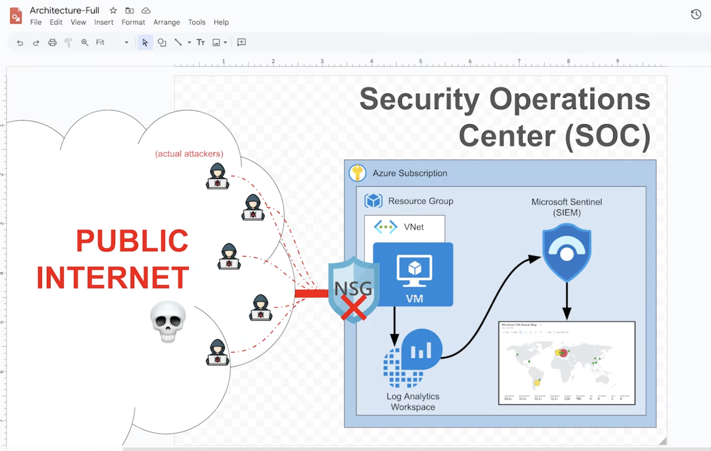
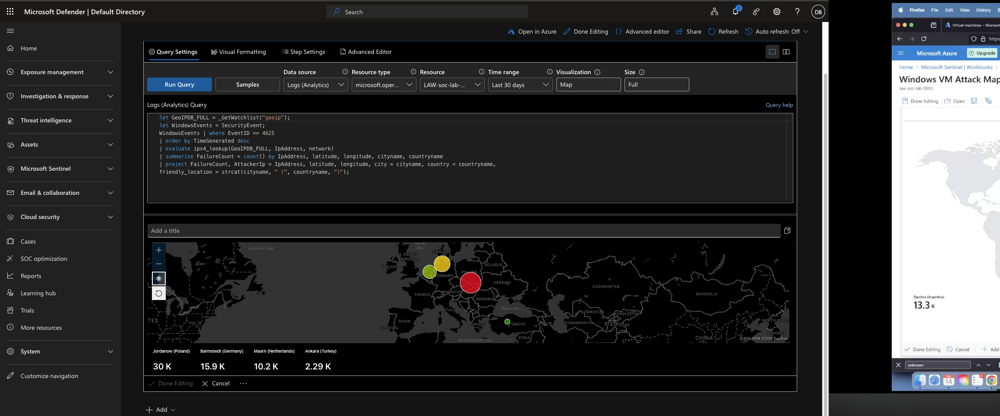
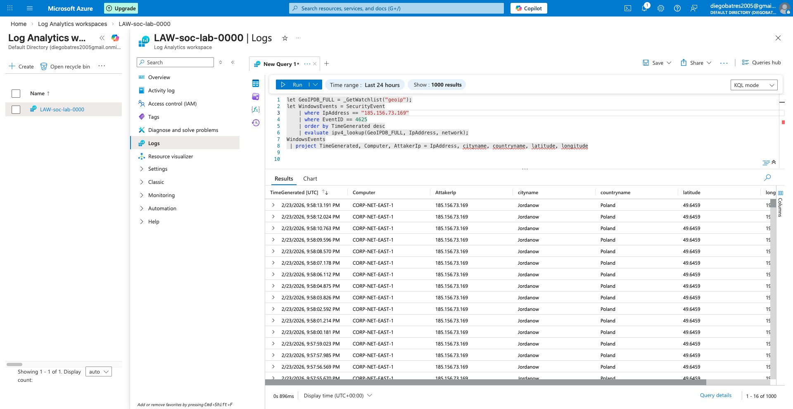
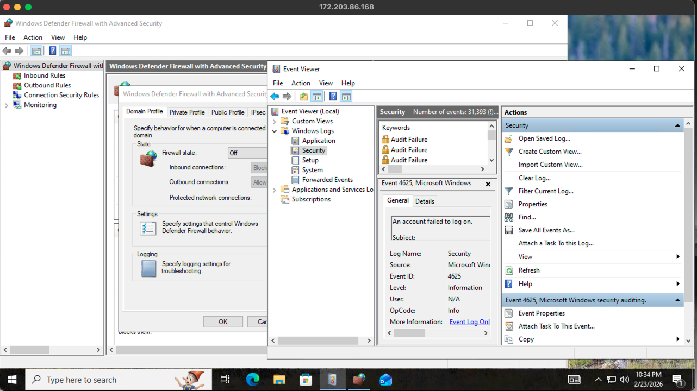

# cloud-soc-lab
Cloud-based SOC lab using Microsoft Azure and Sentinel to detect and analyze attacks

# Cloud-Based SOC Lab (Azure + Sentinel)

## Overview
This project demonstrates the deployment of a cloud-based Security Operations Center (SOC) using Microsoft Azure and Microsoft Sentinel.

## Technologies Used
- Microsoft Azure (Virtual Machines, NSGs)
- Microsoft Sentinel (SIEM)
- Log Analytics Workspace
- Kusto Query Language (KQL)

## What I Did
- Deployed a Windows 10 VM as a honeypot
- Configured Network Security Group (NSG) rules
- Collected and analyzed security logs
- Detected failed login attempts (Event ID 4625)
- Visualized global attack attempts using Sentinel

## Key Features
- Attack map showing login attempts from different countries
- Log analysis using KQL queries
- Real-world simulation of cyber attacks

## Screenshots

## What I Learned
- How to deploy a SOC environment in the cloud
- How to analyze security logs
- How attackers attempt to access systems
